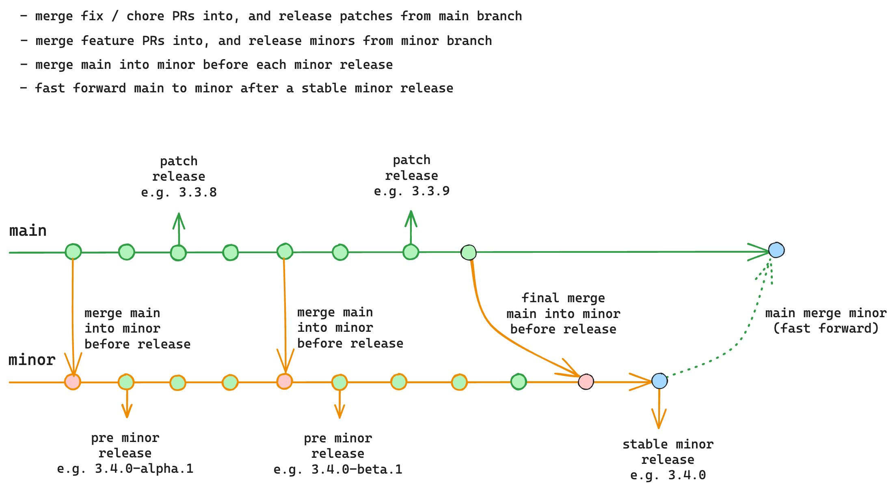

# Maintenance Handbook

this document is mainly intended for team members responsible for maintaining the project. It provides guidelines on how
to triage issues, review & merge PRs, and publish releases.

## Issue Triage Workflow

the workflow for triaging issues is as follows(from vuejs/core):

## Pull Request Review Guidelines

The first step of reviewing a PR is to identify its purpose. We can usually put a PR in one of these categories:

- **Fix**: fixes some wrong behavior. Usually associated with an issue that has a reproduction of the behavior being
  fixed.
- **Refactor**: improves performance or code quality, but does not affect behavior.
- **Feature**: implements something that increases the public API surface.

Depending on the type of the PR, different considerations need to be taken into account.

### Reviewing a Fix

- Is the PR fixing a well-defined issue / bug report?
  - If not, ask to clarify context / provide reproduction or failing test case
- In most cases, a fix PR should include a test case that fails without the fix.
- Is it the right fix?
  - If not, guide user to rework the PR.
  - If the needed change is small and obvious, can directly push to the PR or add inline suggestions to reduce the
    back-and-forth.
- Is the cost justified?
  - Sometimes the fix for a rare edge case might be introducing disproportionately large overhead (perf or code size).
    We should try our best to reduce the overhead to make the fix a reasonable tradeoff.
- If the reviewer is not sure about a fix, try to leave a comment explaining the concerns / reservations so the
  contributor at least gets some feedback.

#### Verifying a Fix

- **Always locally verify that the fix indeed fixes the original behavior, either through a reproduction or a failing
  test case.**

### Reviewing a Refactor

- Performance: if a refactor PR claims to improve performance, there should be benchmarks showcasing said performance
  unless the improvement is self-explanatory.

- Code quality / stylistic PRs: we should be conservative on merging this type PRs because (1) they can be subjective in
  many cases, and (2) they often come with large git diffs, causing merge conflicts with other pending PRs, and leading
  to unwanted noise when tracing changes through git history. Use your best judgement on this type of PRs on whether
  they are worth it.
  - For PRs in this category that are approved, do not merge immediately. Group them before releasing a new minor, after
    all feature-oriented PRs are merged.

### Reviewing a Feature

- Feature PRs should always have clear context and explanation on why the feature should be added, ideally in the form
  of an RFC. If the PR doesn't explain what real-world problem it is solving, ask the contributor to clarify.

- Decide if the feature should require an RFC process. The line isn't always clear, but a rough criteria is whether it
  is augmenting an existing Functions vs. adding a new Functions.

- Always ask if the use case can be solved with existing Functions.

### Common Considerations for All PRs

- Scope: a PR should only contain changes directly related to the problem being addressed. It should not contain
  unnecessary code style changes.

- Implementation: code style should be consistent with the rest of the codebase, follow common best practices. Prefer
  code that is boring but easy to understand over "clever" code.

- Performance
  - Be careful about code changes that could affect performance.

- Potential Breakage
  - avoiding runtime behavior breakage is the highest priority
    - if not sure, use `ecosystem-ci` to verify!
  - some fix inevitably cause behavior change, these must be discussed case-by-case

## PR Merge Rules for Team Members

Given that the PR meets the review requirements:

- Chore / dependencies bumps: can merge directly.
- Fixes / refactors: can merge with two or more approvals from team members.
  - If you believe a PR looks good, but you are not 100% confident to merge, label with "ready for merge" and a team
    member will provide a final review before merging.
- Features: if approved by two or more team members, label with "ready to merge".

## Git Branch and Release Workflow

We use two primary work branches: `main` and `minor`.

- The `main` branch is for stable releases. Changes that are bug fixes or refactors that do not affect the public API
  surface should land in this branch. We periodically release patch releases from the `main` branch.

- The `minor` branch is the WIP branch for the next minor release. Changes that are new features or those that affect
  public API behavior should land in this branch. We will periodically release pre-releases (alpha / beta) for the next
  minor from this branch.

Given a version number MAJOR.MINOR.PATCH, increment the:

1. MAJOR version when you make incompatible API changes
2. MINOR version when you add functionality in a backward compatible manner
3. PATCH version when you make backward compatible bug fixes

Additional labels for pre-release and build metadata are available as extensions to the MAJOR.MINOR.PATCH format. (e.g.
`1.0.0-rc1`)

Before each release, we merge latest `main` into `minor` so it would include the latest bug fixes.

When the minor is ready, we do a final merge of `main` into `minor`, and then release a stable minor from this branch (
e.g. `3.4.0`). After that, the `main` branch is fast-forwarded to the release commit, so the two branches are synced at
each stable minor release.

### Reasoning Behind the Workflow

The reason behind this workflow is to allow merging and releasing of fixes and features in parallel. In the past, we
used a linear trunk-based development model. While the linear model results in a clean git history, the downside is that
we need to be careful about when to merge patches vs. features.

We typically groups a number of features with the same scope in a minor release. We don't want to release a minor just
because we happened to merge a feature PR along with a bunch of small bug fixes. So we usually "wait" until we feel we
are ready to start working on a minor release before merging feature PRs.

But in reality, there are always bugs to fix and patch release to work on - this caused the intervals between minors to
drag on longer than we had hoped, and many feature PRs were left waiting for a long period of time.

This is why we decided to separate bug fixes and feature PRs into separate branches. With this two-branch model, we are
able to merge and release both types of changes in parallel.
